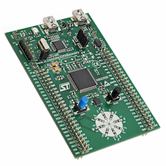

#University of Victoria ELEC 499 Project

Target device is the [STM32F3](http://www.st.com/en/evaluation-tools/stm32f3discovery.html) Discovery board

Development environment: Eclipse using Cross ARM GCC 

[Some](http://www.davidrojas.co.uk/stm32f3discovery-on-mac-os-x-using-eclipse-gcc-arm-and-openocd/ "For Mac at least")  
[Handy](http://stm32f4-discovery.net/2014/05/stm32f4-stm32f429-discovery-pwm-tutorial/)  
[Links](http://visualgdb.com/tutorials/arm/stm32/adc/)  

